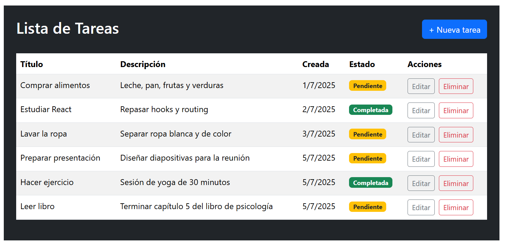
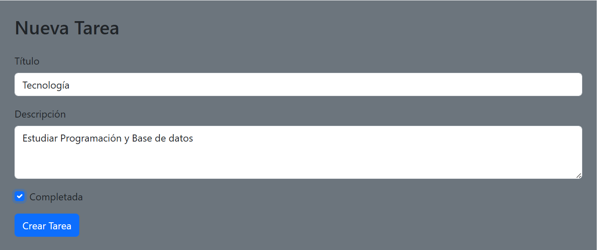
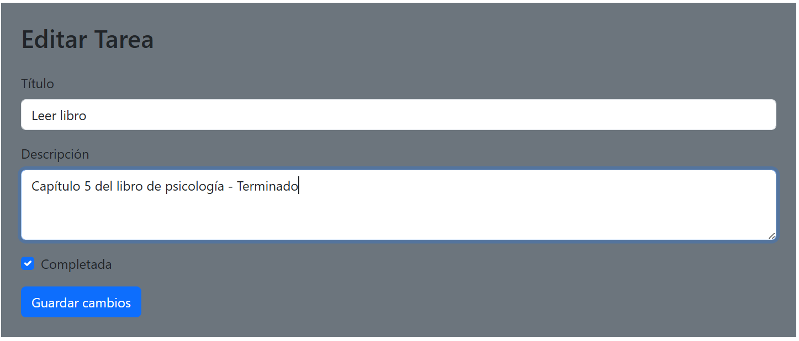
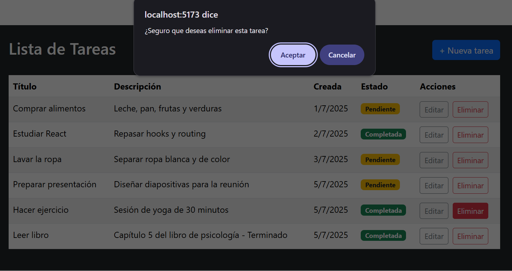

# ToDo App - Challenge Academia ForIt 2025

Aplicación básica de lista de tareas que desarrolla en el marco de un callenge de ingreso a la Acdemia For IT 2025.
Este challenge implica conocimientos en GIT, JavaScript, Node.js, Express y React.

# Algunas Tecnologías utiliadas:
- Node.js
- Express
- React con Vite
- React Router DOM
- Fetch API
- CSS básico
- Dotenv


# Estructura del proyecto:
```plaintext
/
|-- backend/
|   |-- node_modules/
|   |-- .env
|   |-- .env.example
|   |-- .gitkeep
|   |-- index.js
|   |-- package-lock.json
|   |-- package.json
|-- frontend/
|   |-- node_modules/
|   |-- public/
|   |-- src/
|   |   |-- assets/
|   |   |-- components/
|   |   |   |-- TaskList.jsx
|   |   |   |-- TaskItem.jsx
|   |   |   |-- TaskForm.jsx
|   |   |-- css/
|   |   |-- main.jsx
|   |-- .env
|   |-- .env.example
|   |-- .gitignore
|   |-- .gitkeep
|   |-- eslint.config.js
|   |-- index.html
|   |-- package-lock.json
|   |-- package.json
|   |-- vite.config.js
|-- screenshots/
|   |-- home.png
|   |-- add-task.png
|   |-- edit-task.png
|   |-- delete-task.png
|-- README.md
```

# Requisitos previos
- Node.js instalado (v18+ recomendado)
- npm instalado

# Instalación y ejecución
1. Clonar el repositorio
    git clone <URL_DEL_REPOSITORIO>
    cd <nombre-del-repo>

2. Backend
En una terminal:

    cd backend 
    npm install
    cp .env.example .env
    # o crea .env manualmente con:
    # PORT = 3000
    npm run dev

El backend corre por defencto en:
http://localhost:3000/api

3. Frontend
En otra terminal corre:

    cd frontend
    npm install
    cp .env.example .env
    # o crea .env manualmente con:
    # VITE_API_URL=http://localhost:3000/api
    npm run dev

El frontend corre por defecto en:
http://localhost:5173

# Endpoints de la API

Método          Ruta                Descripción
GET             /api/tasks          Obtiene todas las tareas
POST            /api/tasks          Crea una nueva tarea
PUT             /api/tasks/:id      Actualiza una tarea
DELETE          /api/tasks/:id      Elimina una tarea

# Funcionalidad
- Crear tareas
- Leer tareas
- Editar tareas
- Eliminar tareas
- Validación básica y manejo de errores

# Capturas de pantalla
Se adjuntan algunas capturas de ejemplo:

1. Página principal


2. Agregar tarea


3. Editar tarea


4. Eliminar tarea


# Buenas prácticas
- Código validado con ESlint ( npm eslint . )
- Estado manejado con Hooks
- Git con commits atómicos y descriptivos
- Variables de entorno configuradas

# Bonus opcionales implementados
- Validación de formularios
- Tailwind para estilos

# Autor
Eric Ibrahim
- GitHub
